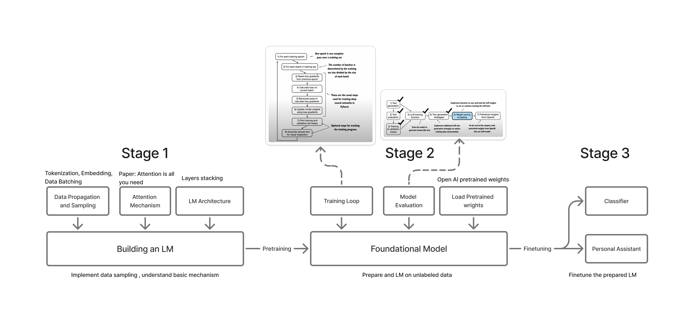

### Language Model Workflow

#### Stage 1: Building an LM

Stage 1 focuses on building a language model (LM) from scratch, emphasizing the fundamental components and architecture required to process and learn from raw text data. It includes three major components:

- **Data Propagation and Sampling**  
  This step handles tokenization, embedding, and batching of raw text. It ensures that data is formatted and fed into the model in a structure that can be effectively learned from.

- **Attention Mechanism**  
  Inspired by the paper *"Attention is All You Need"*, this module allows the model to focus on relevant parts of the input sequence, enabling it to learn dependencies and context across tokens.

- **LM Architecture**  
  The architecture consists of stacked transformer layers, each with multi-head self-attention, feedforward layers, and normalization. These layers enable hierarchical learning of language structure and meaning.

The result of Stage 1 is a basic but functional LM, which is then passed to the pretraining phase for further development into a foundational model.
